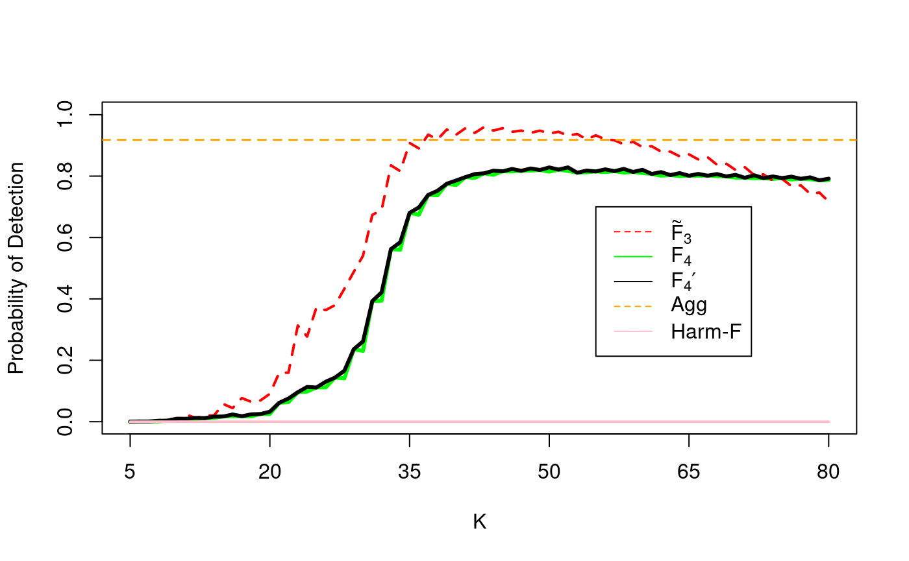

class: inverse

```{r include=FALSE}
library(ggplot2)
filter <- dplyr::filter
knitr::opts_chunk$set(warning=FALSE, message=FALSE, fig.width=10.5, fig.height=4, 
  comment=NA, rows.print=16)
theme_set(theme_gray(base_size = 24))
```

## Time Series Data

Today's problem is from the realm of structured scientific time series data. We have:

-- 

* assumptions about partial stationarity, namely

--

* underlying **noise process** assumed to be covariance stationary

---

class: inverse

## Time Series Signals

Our analysis objective is the detection and characterization
of **signals**: periodic phenomena, observed as part of the
time series. 

--

<br/>
* these phenomena have been of interest for a very long time

--

* earliest was Schuster's *periodicities* in geophysical data (1898, 1899, 1906, 1911)

---

class: inverse

## How to Model?

What's the model for these *signals*?

--

$$
\alpha cos(2\pi f t + \theta)
$$

---

class: inverse

## The Setting

* assume we have a time series, $X_t$

--

* comprised of a stationary noise background (e.g., white noise; simple ARMA
processes) 

--

* with $M > 0$ **embedded** periodic signals

--

<br/>
We write this as:
$X_t = Z_t + \sum_{m=0}^{M} \alpha_m \cos(2\pi f_m t + \theta_m)$

---

class: inverse

## Standard Theory

* Thomson (1982; 1990) developed a theory of **multitaper**
spectrum estimation 

--

* included a tool, the **harmonic F-test**

--

* harmonic F is robust in some senses, but is very sensitive to 
violations of the **structure** of the signal

--

* if there is even slight amounts of modulation on the signal, the test gains very high Type II error. 

---

class: inverse

## Modulation

    In electronics and telecommunications, modulation is the 
    process of varying one or more properties of a periodic
    waveform, called the carrier signal, with a separate signal
    called the modulation signal that typically contains 
    information to be transmitted.
         - Wikipedia, topic "Modulation"
In the case of Frequency Modulation, many of you use this every day:
*tune in to FM103.3, Today's Golden Oldies*. 

--

<br/>
Why do we care about this for scientific data?

---

class: middle 

## Simple Example

The **instantaneous frequency** varies with time.

```{r, echo = FALSE, fig.height=5, fig.width = 10}
f0 <- function(x) {
  0.01 + (x-500)^2 / 50000000
}
x <- 1:1000
y <- sin(2 * pi * f0(x) * x)
plot(x, y, xlab = "Time", ylab = "Amplitude",
     type = "l", xlim = c(500, 1000))
lines(x, sin(2*pi*0.01*x), col = "red")
```

---

class: inverse

## Objective: New Tests for FM-Signals

* we would like to be able to detect signals of this type.

--

* but there are an infinite number of ways to be modulated wrt frequency!

--

* we choose to constrain to polynomial modulation, degree $P$

---

class: inverse

## Progress: $F_2$

With Kian Blanchette, we developed a new test statistic.

* based on Slepian sequences (re)designed as polynomial projection filters

--

* form a F statistic from the eigencoefficients which incorporate instantaneous frequency

--

* if a polynomially modulated signal, order $P$ in modulation, is **not** present, we have, asymptotically, that
$$
F_2 \sim F(1, K-P-1)
$$

---

## Simulation Results


**Figure**: Simulation Results, degrees 0 through 5 polynomial modulation, and NW running 4-11 (colours).

---

## Simulation Results


**Figure**: Simulation Results, degrees 0 through 6 polynomial *tests* (colours) and differing modulation inputs.

---

class: inverse

## Progress: $F_3$ and Aggregated Test

Several results did not make sense in Kian's work, especially
a sensitivity to the analyst choice of $NW$ and/or $K$.

* resulted in spurious detections at the band-edges

--

<br/>
Another student (graduated in August), Ben Ott, picked up the baton.

---


**Figure**: Results of a simulation showing spurious detection
behaviour at band-edges.

---


class: inverse

## Progress: $F_3$

New proposed test. 

--

* same structural form as $F_2$

--

* an (arbitrary) weighting function applied to the tapered inputs

--

* downweights contributions from higher-order tapers

--

* significant improvements: spurious detects at band-edges reduced only slightly above $\alpha$

---

class: inverse

## Aggregate Test

* even with weighting scheme to downweight influence, still constrained by *analyst degrees-of-freedom* choice of $K$

--

* can we create an ensemble instead?

--

* pool a set of individual tests, each with a choice of bandwidth and taper-number

--

* quantiles for each individual test in the ensemble established via the (known, asymptotic) CDFs for each individual parametrization

---

**Unfortunately!** 

The inputs are not independent: the test statistic $T_\alpha$ involves the sum of $|\mathcal{K}|$ correlated Bernoulli RVs.


---

class: inverse

## Solution

Our best solution so far is to take a union upper bound. 

* Advantage: it works!
* Disadvantage: underpowered; throwing away precision

---

class: inverse

## Summary; Take-Aways

* several viable tests for detection of modulated signals against noise

--

* tests work well even in the presence of coloured noise, or mild nonstationary background noise

--

* aggregate test is analyst-friendly: fire-and-forget

--

    - but we still don't know the distribution, and only have empirical guidelines for setting $\alpha$!
    
--

    - more work to be done: more general modulation frameworks; tracking down the final-taper influence; distribution for $T_\alpha$
    
---

layout: false
class: inverse, middle

<center>
<a href="http://www.trentu.ca/math/"></a> &emsp;&emsp;
<a href="https://creativecommons.org/licenses/by/4.0/"></a>
</center>

## Contact Details

- Contact me: [Email](mailto:wesleyburr@trentu.ca) or [Twitter](https://twitter.com/wsburr)
- Joint work with Glen Takahara, Kian Blanchette, and Ben Ott
- Slides created via the R package [xaringan](https://github.com/yihui/xaringan) by Yihui Xie
- Slides and source at <http://bit.ly/asc2023>

<br/>

---

class: inverse

## Formal Details of Time Series Assumptions

Let $X = \{ X_t \}, t = 0, \ldots, N-1$
denote a time series, and assume that $X$ is of the form

$X_t = Z_t + \sum_{m=0}^{M} \mu_m \cos\left(2\pi f_m t + 2 \pi \int_{0}^{t} \phi_m(\tau) d\tau \right)$

where $Z_t$ is a stationary noise process, and 
$\phi_m(\tau) = \sum_{p=0}^{P}  a_p \tau^p$
is a polynomial of degree at most $P$ whose range
in the time span of the data is assumed to lie in a given
bandwidth around 0. We desire to detect the $f_m$, the carrier
frequencies, of the frequency modulated signals. 

---

## Linear Modulation, Simulation

